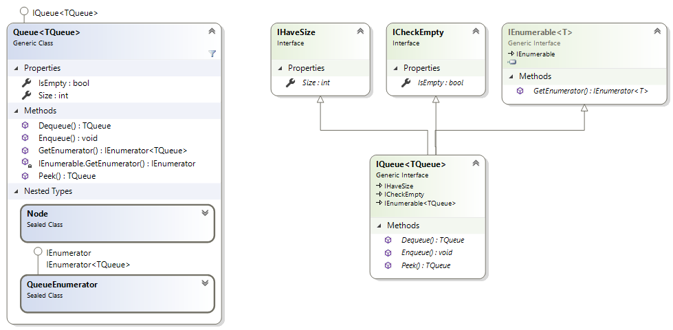
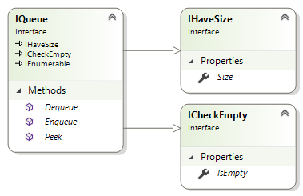

# Collections

Namespace: `SedgewickWayne.Algorithms`.

## Generic

Based solely on **linked lists**.

Class | Princeton java link | .Net implementation
--- | --- | ---
`Bag` | [Bag.java](https://algs4.cs.princeton.edu/13stacks/Bag.java.html) | [Bag.cs](../src/Collections/Generic/Bag.cs)
`Queue` | [Queue.java](https://algs4.cs.princeton.edu/13stacks/Queue.java.html) | [Queue.cs](../src/Collections/Generic/Queue.cs)
`Stack` | [Stack.java](https://algs4.cs.princeton.edu/13stacks/Stack.java.html) | [Stack.cs](../src/Collections/Generic/Stack.cs)

Below the class diagram for the generic queue.

## Non Generic

Based on linked lists and resizing arrays.

Class | Princeton java link
--- | ---
`ResizingArrayBag` | [ResizingArrayBag.java](https://algs4.cs.princeton.edu/13stacks/ResizingArrayBag.java.html) | [ResizingArrayBag.cs](../src/Collections/NonGeneric/ResizingArrayBag.cs)
`ResizingArrayQueue` | [ResizingArrayQueue.java](https://algs4.cs.princeton.edu/13stacks/ResizingArrayQueue.java.html) | [ResizingArrayQueue.cs](../src/Collections/NonGeneric/ResizingArrayQueue.cs)
`ResizingArrayStack` | [ResizingArrayStack.java](https://algs4.cs.princeton.edu/13stacks/ResizingArrayStack.java.html) | [ResizingArrayStack.cs](../src/Collections/NonGeneric/ResizingArrayStack.cs)
`LinkedBag` | [LinkedBag.java](https://algs4.cs.princeton.edu/13stacks/LinkedBag.java.html) | [LinkedBag.cs](../src/Collections/NonGeneric/LinkedBag.cs)
`LinkedQueue` | [LinkedQueue.java](https://algs4.cs.princeton.edu/13stacks/LinkedQueue.java.html) | [LinkedQueue.cs](../src/Collections/NonGeneric/LinkedQueue.cs)
`LinkedStack` | [LinkedStack.java](https://algs4.cs.princeton.edu/13stacks/LinkedStack.java.html) | [LinkedStack.cs](../src/Collections/NonGeneric/LinkedStack.cs)

Bare-bone implementations with a _fixed array_ like [1] & [2] were discarded.

Below the class diagram for the object based queue.

[1]: https://algs4.cs.princeton.edu/13stacks/FixedCapacityStackOfStrings.java.html
[2]: https://algs4.cs.princeton.edu/13stacks/FixedCapacityStack.java.html

[home](../README.md#pages)