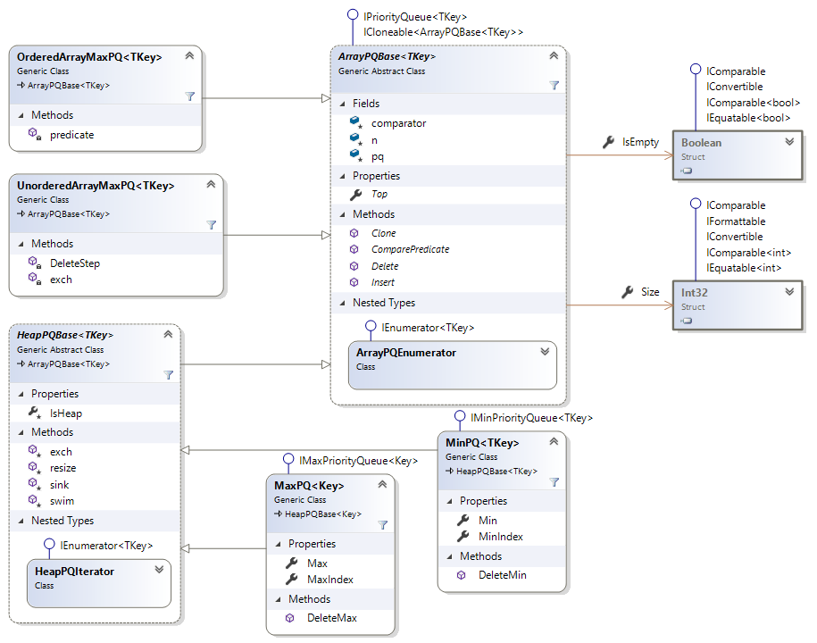

# Priority Queues

Namespace: `SedgewickWayne.Algorithms`.

Folder: [`..\SedgewickWayne.Algorithms\PriorityQueues`](../src/PriorityQueues)

Link: https://algs4.cs.princeton.edu/24pq/

Lecture: https://algs4.cs.princeton.edu/lectures/24PriorityQueues-2x2.pdf

## implementation

Name | Princeton java link | Misc
--- | --- | ---
IndexMaxPQ | [IndexMaxPQ.java](https://algs4.cs.princeton.edu/24pq/IndexMaxPQ.java.html) | [IndexMaxPQ.cs](../src/PriorityQueues/IndexMaxPQ.cs)
IndexMinPQ | [IndexMinPQ.java](https://algs4.cs.princeton.edu/24pq/IndexMinPQ.java.html) | [IndexMinPQ.cs](../src/PriorityQueues/IndexMinPQ.cs)
MaxPQ | [MaxPQ.java](http://algs4.cs.princeton.edu/24pq/MaxPQ.java.html) | [MaxPQ.cs](../src/PriorityQueues/MaxPQ.cs)
MinPQ | [MinPQ.java](http://algs4.cs.princeton.edu/24pq/MinPQ.java.html) | [MinPQ.cs](../src/PriorityQueues/MinPQ.cs)
UnorderedArrayMaxPQ | [UnorderedArrayMaxPQ.java](https://algs4.cs.princeton.edu/24pq/UnorderedArrayMaxPQ.java.html) | [UnorderedArrayMaxPQ.cs](../src/PriorityQueues/UnorderedArrayMaxPQ.cs)
OrderedArrayMaxPQ | [OrderedArrayMaxPQ.java](https://algs4.cs.princeton.edu/24pq/OrderedArrayMaxPQ.java.html) | [OrderedArrayMaxPQ.cs](../src/PriorityQueues/OrderedArrayMaxPQ.cs)
X | [FibonacciMinPQ](https://algs4.cs.princeton.edu/code/edu/princeton/cs/algs4/FibonacciMinPQ.java.html) | -
IndexFibonacciMinPQ | https://algs4.cs.princeton.edu/99misc/IndexFibonacciMinPQ.java.html | -

IPriorityQueue | IMaxPriorityQueue | IMinPriorityQueue | _desc_
--- | --- | --- | ---
Top | Max | Min | largest / lowest key
Delete | DeleteMax | DeleteMin | Removes top key and returns it
Index | MaxIndex | MinIndex | index associated with a minimum/maximum key

## performance

impl | insert | del max | max | remarks
---|---|---|---|---
unordered array | 1 | n | n
ordered array | n | 1 | 1
binary heap | logn | logn | 1
d-ary heap | `logdn` | `dlogdn` | 1 | sweet spot (`d=4`)
Fibonacci | 1 | log n` | 1 | amortized log n
**Brodal** | 1 | log n | 1
holy grail | 1 | 1 | 1 | impossible

[home](../README.md#pages)