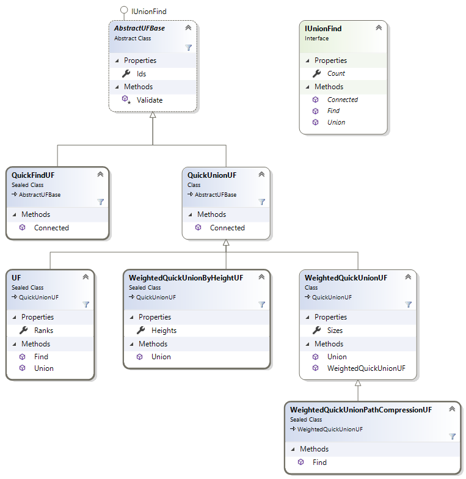

# DynamicConnectivity

.NET classes are in the `SedgewickWayne.Algorithms.DynamicConnectivity` namespace.

`IUnionFind` interface and `AbstractUFBase` were added for OOP design reasons.

Name | Princeton java link
--- | ---
UF | http://algs4.cs.princeton.edu/15uf/UF.java.html
WeightedQuickUnionUF | http://algs4.cs.princeton.edu/15uf/WeightedQuickUnionUF.java.html
WeightedQuickUnionByHeightUF | https://algs4.cs.princeton.edu/15uf/WeightedQuickUnionByHeightUF.java.html
QuickFindUF | http://algs4.cs.princeton.edu/15uf/QuickFindUF.java.html
QuickUnionUF | http://algs4.cs.princeton.edu/15uf/QuickUnionUF.java.html
QuickUnionPathCompressionUF | https://algs4.cs.princeton.edu/15uf/QuickUnionPathCompressionUF.java.html 

## Class diagram

[home](../README.md#pages)